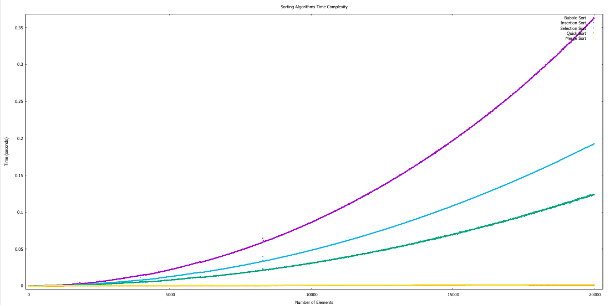

# Sorting Algorithms and Regression Prediction in C

This project implements sorting algorithms and regression prediction in C programming language.

## Getting Started

### Prerequisites
- A C compiler like GCC

### Compilation and Execution

To compile the program:
```bash
gcc -o app.exe main.c
```

To execute the program :
### Windows:
```bash
./main.exe
```
### Linux:
```bash
main.exe
```
### Sorting Algorithms
- With the programm you can compare algorithms of sorting and know how they interact.
Exemple :
```bash
main.exe -algorithm all -size 10/10000/10
```
#### Representation of different sorting algorithms

```bash
main.exe -algorithm all -size 10/10000/10
```
#### Representation of one algorithm
```bash
main.exe -algorithm bubblesort -size 10/10000/10
```

### Regression

This project includes a **linear regression** module that uses mathematical formulas to analyze data through four different models:

1. **Linear Model**: A classic linear relationship where the output is directly proportional to the input.
2. **Logarithmic Model**: A model where the response variable increases logarithmically with the predictor.
3. **Log-Linear Model**: A transformation where the predictor is logarithmic, but the relationship is linear in the log scale.
4. **Quadratic Model**: A model where the response variable is a quadratic function of the predictor, allowing for curvilinear relationships.

### How It Works

The program computes each model using their respective mathematical formulas and compares the accuracy of each by evaluating the residuals (errors) between predicted and actual values. At the end of the analysis, the program identifies the model that best fits the data based on these error comparisons, giving you the most suitable regression type for your dataset.
